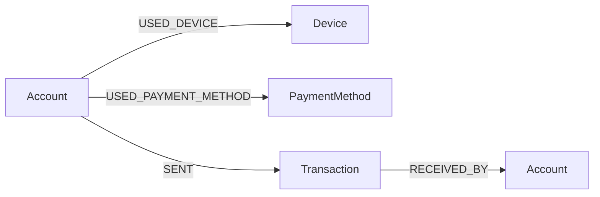

# CognoDB Fraud Ring Explorer

A small web app for investigating fraud rings in a payments dataset: accounts, the devices and
payment methods they used, and the money that moved between them — all modeled as a graph and
queried with openCypher against [CognoDB](https://console.cognodb.com).

## The use case

Banks and payment platforms lose money to *fraud rings*: clusters of accounts that look
independent on the surface (different names, different signup dates) but are secretly linked —
usually because the same person is behind several of them, using the same phone/laptop or the
same stolen card across "different" accounts.

This app answers the questions a fraud analyst actually asks:

- Which accounts share a device fingerprint or a payment method with another account?
- Given one suspicious account, which other accounts is it connected to, and how many hops away?
- What is the shortest chain of shared identifiers connecting two specific accounts?

## Why a graph database?

All three questions above are about **paths and connectivity**, not about individual rows —
and that's exactly where a graph database earns its place over a relational one:

- **Ring detection is a pattern match, not a join.** "Which accounts share a device" is
  `MATCH (a:Account)-[:USED_DEVICE]->(d:Device)<-[:USED_DEVICE]-(b:Account)` — one Cypher
  statement. In SQL it's a self-join per identifier type (`accounts ⋈ devices ⋈ accounts`,
  repeated for payment methods, repeated again if you add IP addresses or emails later), and it
  only gets uglier as the number of identifier types grows.
- **"How is account X connected to account Y?" is a variable-length traversal.** The
  relationship could run through one shared device, or through two accounts and a payment
  method — the path length isn't known in advance. Cypher expresses this natively with
  `-[:USED_DEVICE|USED_PAYMENT_METHOD*1..4]-` and `shortestPath(...)`. SQL has no fixed-depth
  way to express "up to N hops through any of these tables" — you'd need a recursive CTE that
  hardcodes which tables to UNION at each step, and it degrades badly as hop count grows.
- **The schema grows by adding relationship types, not by adding join tables.** Adding a new
  shared-identifier signal (e.g. `USED_IP`) is one new relationship type and one more line in a
  `UNION`-style Cypher query — not a new bridge table and a new join everywhere ring detection
  happens.

The dataset here is small (10 accounts) on purpose — it's sized to demonstrate the model clearly,
not to stress-test it. The same queries scale to the "few thousand to a few hundred thousand
nodes" CognoDB's free tier targets without changing shape.

## Data model



| Node            | Key properties                              |
|-----------------|----------------------------------------------|
| `Account`       | `id`, `name`, `opened_at`, `status`           |
| `Device`        | `id`, `fingerprint`                           |
| `PaymentMethod` | `id`, `type`, `masked_number`                 |
| `Transaction`   | `id`, `amount`, `timestamp`                   |

| Relationship             | Direction                          | Meaning                                  |
|--------------------------|-------------------------------------|-------------------------------------------|
| `(:Account)-[:USED_DEVICE]->(:Device)` | Account → Device | Account logged in / transacted from this device |
| `(:Account)-[:USED_PAYMENT_METHOD]->(:PaymentMethod)` | Account → PaymentMethod | Account used this card/bank method |
| `(:Account)-[:SENT]->(:Transaction)-[:RECEIVED_BY]->(:Account)` | sender → tx → receiver | Money movement between accounts |

`Transaction` is modeled as its own node (not a plain edge) because it carries its own properties
(`amount`, `timestamp`) and has two distinct ends — a pattern relational modeling would call an
associative entity, and graph modeling handles the same way.

## Project structure

```
cognodb-assignment/
├── backend/            Flask API + Cypher queries
│   ├── app.py          Routes, error handling
│   ├── db.py           Neo4j driver singleton (reads NEO4J_* env vars)
│   ├── seed.py         Seed script — loads the sample dataset described above
│   └── requirements.txt
├── frontend/            React (Vite) UI
│   └── src/
│       ├── api.js               Typed fetch wrapper, one function per endpoint
│       ├── App.jsx               Top-level state + layout
│       └── components/           Header, AccountsTable, FraudRings, NetworkExplorer, etc.
├── docker-compose.yml   Optional local Neo4j for offline dev (see below) — not used for grading
└── README.md
```

## Setup

### 1. Create a CognoDB Cloud instance

1. Sign up at [console.cognodb.com/signup](https://console.cognodb.com/signup) (free, no card).
2. Create a free **c0** instance and pick a region. It provisions in under a minute.
3. Copy the connection URI (`bolt+s://<instance-id>.databases.cognodb.cloud`) and the generated
   password for user `cognodb` — **the password is shown once**, save it now.

### 2. Backend

```bash
cd backend
python -m venv venv
venv/Scripts/activate        # venv\Scripts\activate.bat on cmd, venv/bin/activate on macOS/Linux
pip install -r requirements.txt
cp .env.example .env         # then fill in your CognoDB URI/user/password
python seed.py                # loads the sample dataset
python app.py                 # http://localhost:5000
```

`backend/.env`:

```
NEO4J_URI=bolt+s://<instance-id>.databases.cognodb.cloud
NEO4J_USER=cognodb
NEO4J_PASSWORD=<your generated password>
```

### 3. Frontend

```bash
cd frontend
npm install
cp .env.example .env          # VITE_API_URL, defaults to http://localhost:5000
npm run dev                    # http://localhost:5173
```

### Optional: local Neo4j instead of CognoDB Cloud

For offline development only, `docker-compose up -d` starts a local Neo4j 5 container that
speaks the same Bolt protocol — point `backend/.env` at `bolt://localhost:7687` /
`neo4j` / `devpassword123` (see `docker-compose.yml`). The submitted/graded instance is CognoDB
Cloud, per the assignment.

## The queries, explained

All queries are parameterised through the official `neo4j` Python driver — no string-concatenated
Cypher anywhere in `app.py`.

- **`GET /api/accounts`** — flat list, one `MATCH (a:Account) RETURN a`. The baseline "just show
  me a table" view.
- **`GET /api/accounts/<id>`** — one account plus its devices, payment methods, and sent/received
  transactions, fanned out with `OPTIONAL MATCH` in a single round trip instead of four separate
  queries.
- **`GET /api/fraud-rings`** — the core ring-detection query:
  ```cypher
  MATCH (a:Account)-[:USED_DEVICE]->(d:Device)
  WITH d, collect(DISTINCT a.id) AS account_ids
  WHERE size(account_ids) > 1
  RETURN d.id AS shared_resource_id, account_ids
  ```
  (mirrored for `USED_PAYMENT_METHOD`). Groups accounts by shared identifier and flags any
  identifier used by more than one account — the multi-table self-join problem described above,
  solved as a single pattern match per identifier type.
- **`GET /api/accounts/<id>/network`** — the multi-hop traversal:
  ```cypher
  MATCH (a:Account {id: $account_id})
  MATCH path = (a)-[:USED_DEVICE|USED_PAYMENT_METHOD*1..4]-(other:Account)
  WHERE other <> a
  WITH other, min(length(path)) AS distance
  RETURN other.id AS id, other.name AS name, distance
  ```
  Every account reachable within 4 hops through either identifier type, with the shortest
  distance to each. Variable-length, multi-relationship-type traversal with no fixed SQL shape.
- **`GET /api/accounts/<id>/path/<other_id>`** — shortest connection between two specific
  accounts via `shortestPath((a)-[:USED_DEVICE|USED_PAYMENT_METHOD*..10]-(b))`, returning the
  actual chain of nodes (account → device/payment method → account → ...) so the UI can show
  *why* two accounts are linked, not just that they are.

## Error handling

If CognoDB is unreachable, `app.py` catches `neo4j.exceptions.ServiceUnavailable` /
`Neo4jError` at the Flask app level and returns a `503`/`502` JSON error instead of a stack
trace. The frontend surfaces this as a status pill in the header and an inline error banner with
a retry button, rather than a blank or broken page.

## Deploying

### Backend → Render

1. Push this repo to GitHub.
2. On [render.com](https://render.com), **New → Web Service**, connect the repo, root
   directory `backend`.
3. Build command: `pip install -r requirements.txt`. Start command: `gunicorn app:app`
   (already declared in `backend/Procfile`).
4. Add environment variables `NEO4J_URI`, `NEO4J_USER`, `NEO4J_PASSWORD` (your CognoDB Cloud
   values) in the Render dashboard — never commit them.
5. Deploy, then note the public URL Render gives you
   (e.g. `https://cognodb-backend.onrender.com`).

### Frontend → Vercel

1. On [vercel.com](https://vercel.com), **New Project**, import the same repo, set the root
   directory to `frontend` (Vercel auto-detects the Vite build).
2. Add environment variable `VITE_API_URL` = your Render backend URL from above.
3. Deploy. Vercel gives you a public `https://*.vercel.app` URL — that's the hosted demo link.

Render's free tier spins down after inactivity and takes ~30s to wake on the first request —
expected on first load of the demo.

### Docker (alternative / self-hosting)

Both services also have standalone `Dockerfile`s, useful for Render's Docker-based deploys or
self-hosting anywhere else that runs containers:

```bash
docker build -t cognodb-backend ./backend
docker run -p 5000:5000 --env-file backend/.env cognodb-backend

docker build -t cognodb-frontend --build-arg VITE_API_URL=http://localhost:5000 ./frontend
docker run -p 8080:80 cognodb-frontend
```

Vercel builds the frontend natively from source and doesn't use `frontend/Dockerfile` — it's
there for non-Vercel hosting.

## Screenshots

_Add screenshots of the running app here before submitting._

## Live demo

- **Hosted app:** _add link_
- **Screen recording:** _add link_
